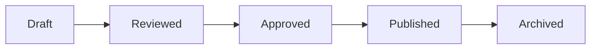

# ABAC System (Attribute-Based Access Control)

## Overview

AWCMS implements a comprehensive ABAC (Attribute-Based Access Control) system that manages user permissions across all modules, combining traditional roles with granular policy enforcement.

---

## RBAC Architecture

```text
┌──────────────────────────────────────────────────────────────┐
│                      ABAC HIERARCHY                          │
├──────────────────────────────────────────────────────────────┤
│                                                              │
│   ┌─────────┐         ┌─────────┐         ┌─────────────┐   │
│   │  USERS  │────────▶│  ROLES  │────────▶│ PERMISSIONS │   │
│   └─────────┘         └─────────┘         └─────────────┘   │
│        │                   │                     │           │
│        │                   │                     ▼           │
│        │                   │              ┌─────────────┐   │
│        │                   └─────────────▶│   MODULES   │   │
│        │                                  └─────────────┘   │
│        │                                        │           │
│        │                                        ▼           │
│        │                                  ┌─────────────┐   │
│        │                                  │  CONDITIONS │   │
│        │                                  └─────────────┘   │
│        │                                        │           │
│        │                                        ▼           │
│        └─────────────────────────────────▶│  UI ACCESS  │   │
│                                           └─────────────┘   │
│                                                              │
└──────────────────────────────────────────────────────────────┘
```

---

## Database Schema

### Users Table

```sql
CREATE TABLE users (
  id UUID PRIMARY KEY DEFAULT gen_random_uuid(),
  email TEXT UNIQUE NOT NULL,
  full_name TEXT,
  role_id UUID REFERENCES roles(id),
  avatar_url TEXT,
  created_at TIMESTAMPTZ DEFAULT NOW(),
  updated_at TIMESTAMPTZ DEFAULT NOW(),
  deleted_at TIMESTAMPTZ
);
```

### Roles Table

```sql
CREATE TABLE roles (
  id UUID PRIMARY KEY DEFAULT gen_random_uuid(),
  name TEXT UNIQUE NOT NULL,
  description TEXT,
  is_system BOOLEAN DEFAULT FALSE,
  created_at TIMESTAMPTZ DEFAULT NOW()
);
```

### Permissions Table

```sql
CREATE TABLE permissions (
  id UUID PRIMARY KEY DEFAULT gen_random_uuid(),
  name TEXT UNIQUE NOT NULL,
  description TEXT,
  module TEXT NOT NULL,
  action TEXT NOT NULL
);
```

### Role Permissions (Junction)

```sql
CREATE TABLE role_permissions (
  role_id UUID REFERENCES roles(id) ON DELETE CASCADE,
  permission_id UUID REFERENCES permissions(id) ON DELETE CASCADE,
  PRIMARY KEY (role_id, permission_id)
);
```

---

## Final Role Hierarchy (ERP Standard)

### 1. Global Scope

* **Owner**: The supreme authority. Has access to everything.
* **Super Admin**: Platform administrator. Manages tenants and global settings.

### 2. Tenant Scope

* **Admin**: Tenant administrator. Full access within their own tenant.
* **Editor**: Content manager. Can review and approve content.
* **Author**: Content creator. Can create drafts but needs approval to publish.
* **Member**: Registered regular user.
* **Subscriber**: Read-only access to premium content.

### 3. System Roles

* **Public**: Anonymous visitors.
* **No Access**: Banned or disabled users.

---

## 2. Permission Matrix per Role (INTI)

### Matriks Hak Akses - Tenant Content

📌 *Semua permission hanya berlaku dalam tenant masing-masing*

#### A. Post / Page / Content

| Role | C | R | U | P | SD | RS | DP | Description |
| :--- | :--: | :--: | :--: | :--: | :--: | :--: | :--: | :--- |
| **Owner (Global)** | ✅ | ✅ | ✅ | ✅ | ✅ | ✅ | ✅ | Supreme authority (Global) |
| **Super Admin (Global)** | ✅ | ✅ | ✅ | ✅ | ✅ | ✅ | ✅ | Platform management (Global) |
| **Admin (Tenant)** | ✅ | ✅ | ✅ | ✅ | ✅ | ✅ | ❌ | Tenant management (Tenant) |
| **Editor (Tenant)** | ✅ | ✅ | ✅ | ✅ | ✅ | ❌ | ❌ | Content review & approval |
| **Author (Tenant)** | ✅ | ✅ | ✅* | ❌ | ❌ | ❌ | ❌ | Content creation & update own |
| **Member** | ❌ | ✅ | ❌ | ❌ | ❌ | ❌ | ❌ | Commenting & Profile management |
| **Subscriber** | ❌ | ✅ | ❌ | ❌ | ❌ | ❌ | ❌ | Premium content access |
| **Public** | ❌ | ✅ | ❌ | ❌ | ❌ | ❌ | ❌ | Read-only access |
| **No Access** | ❌ | ❌ | ❌ | ❌ | ❌ | ❌ | ❌ | Banned/Disabled |

*\* Author → hanya konten milik sendiri (tenant_id + owner_id)*

**Legend:**

* **C**: Create
* **R**: Read
* **U**: Update
* **P**: Publish
* **SD**: Soft Delete
* **RS**: Restore
* **DP**: Delete Permanent

---

## 1. Daftar Permission (Final & Konsisten)

### A. Platform (Global Scope)

| Permission Key | C | R | U | SD | RS | DP | Channel |
| :--- | :---: | :---: | :---: | :---: | :---: | :---: | :--- |
| `platform.tenant` | ✅ | ✅ | ✅ | ✅ | ✅ | ✅ | web |
| `platform.setting` | ❌ | ✅ | ✅ | ❌ | ❌ | ❌ | web |
| `platform.module` | ✅ | ✅ | ✅ | ❌ | ❌ | ❌ | web |
| `platform.billing` | ❌ | ✅ | ✅ | ❌ | ❌ | ❌ | web |
| `platform.user` | ✅ | ✅ | ✅ | ✅ | ✅ | ✅ | web |

### B. Tenant (Tenant Scope) - Standardized Pattern

**Format Permission**: `tenant.{module}.{action}`

**Actions Available**:

* `read` - View/list items
* `create` - Create new items
* `update` - Edit existing items
* `delete` - Soft delete items
* `restore` - Restore from trash
* `permanent_delete` - Permanently delete items
* `publish` - Publish content (content modules only)

#### Content Modules

| Module | Permission Prefix | Actions |
| :--- | :--- | :--- |
| Articles | `tenant.article.*` | read, create, update, delete, restore, permanent_delete, publish |
| Pages | `tenant.page.*` | read, create, update, delete, restore, permanent_delete, publish |
| Portfolio | `tenant.portfolio.*` | read, create, update, delete, restore, permanent_delete |
| Testimonies | `tenant.testimonies.*` | read, create, update, delete, restore, permanent_delete |
| Announcements | `tenant.announcements.*` | read, create, update, delete, restore, permanent_delete |
| Promotions | `tenant.promotions.*` | read, create, update, delete, restore, permanent_delete |

#### Media Modules

| Module | Permission Prefix | Actions |
| :--- | :--- | :--- |
| Media | `tenant.media.*` | read, create, update, delete, manage |
| Photo Gallery | `tenant.photo_gallery.*` | read, create, update, delete, restore, permanent_delete |
| Video Gallery | `tenant.video_gallery.*` | read, create, update, delete, restore, permanent_delete |

#### Commerce Modules

| Module | Permission Prefix | Actions |
| :--- | :--- | :--- |
| Products | `tenant.products.*` | read, create, update, delete, restore, permanent_delete |
| Product Types | `tenant.product_types.*` | read, create, update, delete, restore, permanent_delete |
| Orders | `tenant.orders.*` | read, create, update, delete, restore, permanent_delete |

#### Navigation & Taxonomy

| Module | Permission Prefix | Actions |
| :--- | :--- | :--- |
| Menus | `tenant.menu.*` | read, create, update, delete |
| Categories | `tenant.categories.*` | read, create, update, delete, restore, permanent_delete |
| Tags | `tenant.tag.*` | read, create, update, delete, restore, permanent_delete |

#### User Management

| Module | Permission Prefix | Actions |
| :--- | :--- | :--- |
| Users | `tenant.user.*` | read, create, update, delete |

#### System

| Module | Permission Prefix | Actions |
| :--- | :--- | :--- |
| Settings | `tenant.setting.*` | read, update |
| Themes | `tenant.theme.*` | read, create, update, delete |
| Audit Logs | `tenant.audit.*` | read |
| Notifications | `tenant.notification.*` | read |
| Contacts | `tenant.contacts.*` | read, create, update, delete, restore, permanent_delete |
| Contact Messages | `tenant.contact_messages.*` | read, create, update, delete, restore, permanent_delete |
| Regions | `tenant.region.*` | read, create, update, delete |
| Visual Pages | `tenant.page.*` | read, create, update, delete, restore |

#### Mobile & IoT

| Module | Permission Prefix | Actions |
| :--- | :--- | :--- |
| Mobile Users | `tenant.mobile_users.*` | read, create, update, delete |
| Push Notif | `tenant.push_notifications.*` | read, create, delete |
| Mobile Config | `tenant.mobile_config.*` | read, update |
| IoT Devices | `tenant.iot_devices.*` | read, create, update, delete |

### C. Public / Consumption

| Permission Key | R | Channel |
| :--- | :---: | :--- |
| `content.read` | ✅ | all |
| `content.comment` | ✅ | web, mobile |
| `content.like` | ✅ | web, mobile |

---

## Implementation

### Permission Context

```jsx
// src/contexts/PermissionContext.jsx
import { createContext, useContext } from 'react';

const PermissionContext = createContext();

export function PermissionProvider({ children }) {
  const [permissions, setPermissions] = useState([]);
  const [role, setRole] = useState(null);

  const hasPermission = (permission) => {
    if (role === 'super_admin') return true;
    return permissions.includes(permission);
  };

  return (
    <PermissionContext.Provider value={{ hasPermission, role, permissions }}>
      {children}
    </PermissionContext.Provider>
  );
}

export const usePermission = () => useContext(PermissionContext);
```

### Protected Component

```jsx
import { usePermission } from '@/contexts/PermissionContext';

function ArticleActions({ article }) {
  const { hasPermission } = usePermission();

  return (
    <div className="flex gap-2">
      {hasPermission('edit_articles') && (
        <Button onClick={() => editArticle(article.id)}>Edit</Button>
      )}
      {hasPermission('delete_articles') && (
        <Button variant="destructive" onClick={() => deleteArticle(article.id)}>
          Delete
        </Button>
      )}
    </div>
  );
}
```

### Protected Route

```jsx
import { Navigate } from 'react-router-dom';
import { usePermission } from '@/contexts/PermissionContext';

function ProtectedRoute({ children, permission }) {
  const { hasPermission } = usePermission();

  if (!hasPermission(permission)) {
    return <Navigate to="/403" />;
  }

  return children;
}

// Usage
<Route 
  path="/cmspanel/users" 
  element={
    <ProtectedRoute permission="view_users">
      <UsersPage />
    </ProtectedRoute>
  } 
/>
```

---

## Menu Permissions

Sidebar menus are filtered based on user permissions:

```sql
CREATE TABLE menu_permissions (
  menu_id UUID REFERENCES menus(id),
  role_id UUID REFERENCES roles(id),
  can_view BOOLEAN DEFAULT FALSE,
  PRIMARY KEY (menu_id, role_id)
);
```

### Menu Visibility Logic

```javascript
const visibleMenus = allMenus.filter(menu => {
  // Super admin sees everything
  if (role === 'super_admin') return true;
  
  // Check menu permission for user's role
  return menuPermissions.some(
    mp => mp.menu_id === menu.id && mp.role_id === userRoleId && mp.can_view
  );
});
```

---

## API Security

Row Level Security (RLS) enforces permissions at database level:

```sql
-- Only users with 'view_articles' permission can select
CREATE POLICY "articles_select_policy" ON articles
FOR SELECT
USING (
  auth.jwt() ->> 'role' = 'super_admin'
  OR EXISTS (
    SELECT 1 FROM role_permissions rp
    JOIN permissions p ON rp.permission_id = p.id
    WHERE rp.role_id = (auth.jwt() ->> 'role_id')::uuid
    AND p.name = 'view_articles'
  )
);
```

---

## 🛡️ ABAC & Policy Engine (ERP Standard)

Starting from v2.5, AWCMS introduces Attribute-Based Access Control (ABAC) alongside RBAC to support fine-grained, context-aware restrictions.

### Policy Structure

Policies are defined as JSON objects linked to Roles via the `role_policies` table.

```json
{
  "name": "Restrict Mobile Deletion",
  "effect": "deny", 
  "actions": ["delete"],
  "conditions": {
    "channel": "mobile",
    "time_start": "09:00",
    "time_end": "17:00"
  }
}
```

### Evaluation Logic (`PermissionContext.jsx`)

1. **Super Admin Bypass**: Always TRUE.
2. **Global Policies**: Checked first.
3. **Role Policies**: Checked next.
4. **Logic**:
   * Default is **ALLOW** (RBAC foundation).
   * Policies act as **DENY** overrides (Restrictive model).
   * If *any* policy matches the action/resource AND conditions evaluate to true, access is **DENIED**.

### Context Variables

| Variable | Description | Source |
| ---------- | ------------- | -------- |
| `channel` | Interface used (`web`, `mobile`, `api`) | `useContext` or API Header |
| `ip_address` | Client IP | Edge Function |
| `time` | Server time | Edge Function |

---

## 📋 Audit Trail System

Compliance-grade logging is enforced for all critical write operations.

### Schema (`audit_logs`)

| Field | Type | Description |
| ------- | ------ | ------------- |
| `action` | TEXT | format: `resource.verb` (e.g. `user.create`) |
| `old_value` | JSONB | Snapshot before change |
| `new_value` | JSONB | Snapshot after change |
| `channel` | TEXT | Source (`web`, `mobile`, `api`) |
| `tenant_id` | UUID | Tenant isolation |

---

## 🔒 Multi-Device Access Control

### Channel Enum

* `web`: Main Dashboard & Portal
* `mobile`: IOS / Android Apps
* `api`: 3rd Party Integrations
* `all`: Universal access

### Security Principles

1. **Governance & Publish** → **Web Only**. Critical actions like changing settings or publishing content restricted to Web Dashboard.
2. **Mobile** → **Create & Update**. Field operations (writing drafts, uploading photos) allowed.
3. **API** → **Read-Heavy, Controlled Write**. Mostly for consumption. Writes require explicit API keys with scopes.

---

## ⚖️ Separation of Duties (SoD)

Ensures that critical processes involve multiple roles to prevent fraud or error.

| Activity | Authorized Role |
| ---------- | ----------------- |
| **Create** | Author |
| **Review** | Editor |
| **Approve / Publish** | Admin |
| **Governance** | Owner |

---

## 🔄 Workflow State Machine

Content modules (`posts`, `pages`) follow a strict lifecycle state machine:



| State | Who can set? |
| ------- | -------------- |
| `draft` | Author, Editor |
| `reviewed` | Editor |
| `approved` | Editor, Admin |
| `published` | Admin, Publisher |

---

## Best Practices

1. **Principle of Least Privilege**: Grant minimum permissions needed
2. **Role Separation**: Create specific roles for specific functions
3. **Audit Trail**: Log permission changes
4. **Regular Review**: Periodically review role assignments

## 🔒 Data Isolation & Security

To ensure strict multi-tenancy (SaaS), the following rules are enforced at the database level:

### 1. Mandatory `tenant_id`

All tables (except global system tables like `tenants`) MUST have a `tenant_id` column.

* **Type**: `UUID`
* **Reference**: `public.tenants(id)`
* **Constraint**: `NOT NULL` (enforced via migration)

### 2. RLS Enforcement (Strict)

Row Level Security (RLS) is enabled on **ALL tables** and has been audited for "Permissive" leaks.

* **Default**: Deny All.
* **Policy**: Must use `current_tenant_id()` helper.
* **Public Data**: Only specific global settings (`is_public=true`) or public content are exempted from strict tenant checks.

```sql
-- Standard Policy Pattern
CREATE POLICY "Tenant Isolation Select" ON table_name
FOR SELECT TO authenticated
USING (
  (tenant_id = public.current_tenant_id()) 
  OR 
  (is_platform_admin()) -- Super Admins can see all
);
```

### 3. Performance & Indexing

* **Index required**: `CREATE INDEX ON table_name(tenant_id)`
* **Composite Indexes**: When frequently filtering by other columns, put `tenant_id` first (e.g., `(tenant_id, created_at)`).

### 4. Tier-Based Access

Feature access is dynamically filtered based on `tenants.subscription_tier` ('free', 'pro', 'enterprise').

* **UI**: Sidebar hides menu items (`checkTierAccess`).
* **API**: Extensions and advanced modules check tier capability before execution.
