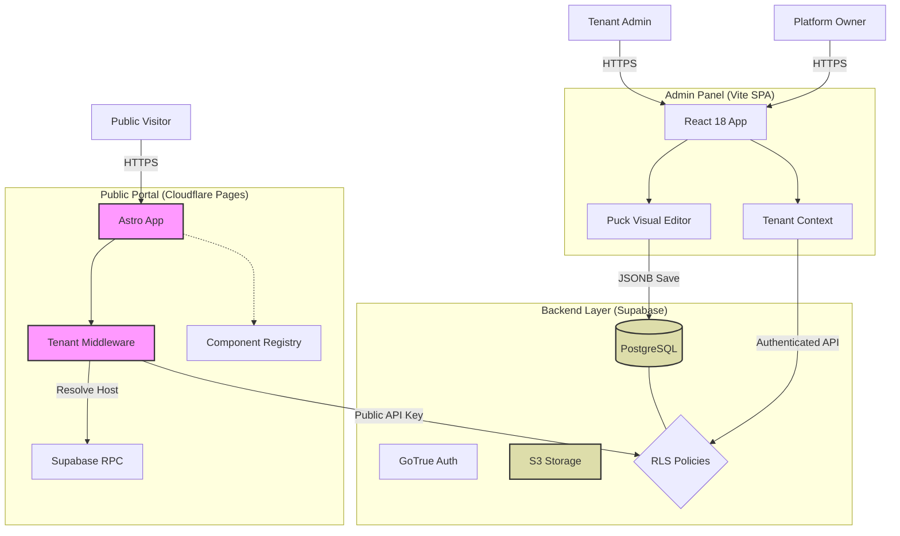

# System Architecture

## Overview

AWCMS utilizes a **Headless SPA Architecture** where the frontend is completely decoupled from the backend, communicating exclusively via API calls to Supabase.

---

## Architecture Diagram



---

## Core Layers

### 1. Presentation Layer (Client)

```text
src/
├── components/
│   ├── dashboard/      # Admin-specific
│   └── public/         # Public-facing (Tenant aware)
├── contexts/
│   ├── TenantContext.jsx     # Domain resolution
│   ├── ThemeContext.jsx      # Dynamic branding
│   └── PermissionContext.jsx # RBAC + Limits
```

### 2. State Management Layer

```text

src/contexts/
├── SupabaseAuthContext.jsx   # Authentication state
├── PermissionContext.jsx     # RBAC permissions
└── ThemeContext.jsx          # Theme preferences
```

### 3. Service Layer

```text
src/lib/
├── customSupabaseClient.js   # Public client (RLS enforced)
├── tenantUtils.js            # Resolution helpers
└── utils.js                  # Shared logic
```

### 4. Data Layer (Supabase)

- **Multi-Tenancy**: All queries MUST be explicitly filtered by `tenant_id` in the application layer AND enforced via RLS.
- **Limits**: RPC functions enforce Subscription Quotas (Users, Storage).

---

## Data Flow

```text
User Request (subdomain.awcms.com)
    │
    ▼
TenantResolution (App.jsx)
    │
    ├── Lookup 'tenants' table via RPC
    ├── Inject CSS Variables (config)
    └── Set TenantID in Context
    │
    ▼
Supabase Client
    │
    ├── Request + Explicit TenantID (For Filtering/Creation)
    ▼
Database (RLS Policy: tenant_id = current_tenant_id AND Application Filter)
```

---

## Authentication Flow

```text
┌─────────────┐     ┌─────────────┐     ┌─────────────┐
│   Login     │────▶│  Supabase   │────▶│   Session   │
│             │     │    Auth     │     │ (w/ Role)   │
└─────────────┘     └─────────────┘     └─────────────┘
                           │
                           ▼
                    ┌─────────────┐
                    │ TenantCtx   │◀─── Check User's
                    │ (Context)   │     TenantID
                    └──────┬──────┘
                           │
           ┌───────────────┼───────────────┐
           ▼               ▼               ▼
      Protected       PermissionContext   Theme Wrapper
       Routes          (RBAC + Limits)    (Apply Brand)
```

---

## Security Architecture

| Layer | Security Measure |
|-------|------------------|
| Frontend | TipTap (XSS-safe), Input validation |
| Transport | HTTPS only, Secure cookies |
| API | Row Level Security (RLS) policies |
| Database | PostgreSQL roles, Column-level security |
| Auth | JWT tokens, Refresh token rotation |
| Storage | Bucket-level policies |

---

## Key Design Decisions

### 1. No Server-Side Rendering

- Pure SPA architecture for simplicity
- SEO handled via `react-helmet-async`

### 2. Database-First

- Schema drives functionality
- Supabase auto-generates APIs from PostgreSQL

### 3. Context over Redux

- Simpler state management
- Sufficient for CMS scope

### 4. Soft Delete Pattern

- All deletions set `deleted_at` timestamp
- Data recovery is always possible

### 5. Environment Variables

- Credentials never hardcoded
- `.env.local` for local development
- Proper `.gitignore` prevents leaks
