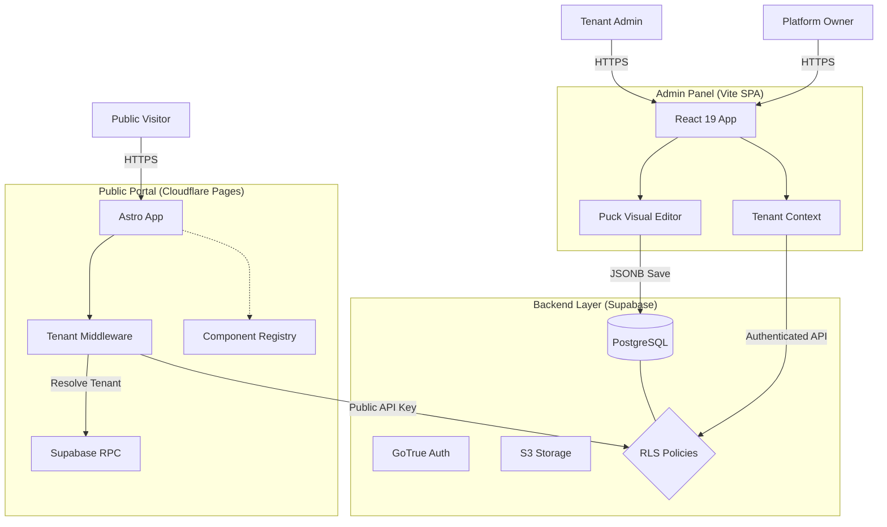

# System Architecture

## Purpose

Describe the runtime architecture and data flow across the AWCMS monorepo.

## Audience

- Developers working across admin/public/mobile/IoT
- Operators configuring deployments

## Prerequisites

- `docs/architecture/standards.md`
- `docs/tenancy/overview.md`

## Core Concepts

AWCMS is a headless system with multiple clients sharing a Supabase backend:

- Admin Panel: React 19 SPA (Vite)
- Public Portal: Astro SSR/Islands (Cloudflare Pages)
- Mobile: Flutter app
- IoT: ESP32 firmware

## How It Works

### Architecture Diagram

### Admin Panel Flow

1. TenantContext resolves tenant via `get_tenant_by_domain`.
2. `setGlobalTenantId()` injects `x-tenant-id` on Supabase requests.
3. UI components enforce ABAC with `usePermissions()`.
4. All writes use soft delete for removal.

### Public Portal Flow

1. Middleware resolves tenant by path slug, then host fallback.
2. `locals.tenant_id` is passed to request-scoped Supabase clients.
3. Pages render with `PuckRenderer` and a registry allow-list.

## Implementation Patterns

- Admin client: `awcms/src/lib/customSupabaseClient.js`
- Public client: `awcms-public/primary/src/lib/supabase.ts`
- Tenant resolution: `awcms/src/contexts/TenantContext.jsx` and `awcms-public/primary/src/middleware.ts`

## Security and Compliance Notes

- Tenant isolation is enforced at UI, API, and database layers.
- ABAC checks are mandatory at entry points and on data operations.
- Supabase is the only backend; no custom servers.

## Operational Concerns

- Admin and public apps are deployed as separate Cloudflare Pages projects.
- Supabase migrations are managed in `supabase/migrations`.

## Troubleshooting

- See `docs/dev/troubleshooting.md`.

## References

- `docs/tenancy/overview.md`
- `docs/tenancy/supabase.md`
- `docs/modules/PUBLIC_PORTAL_ARCHITECTURE.md`
