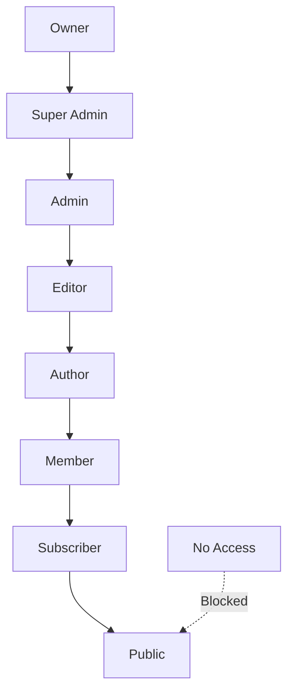

# Role Hierarchy

## Purpose
Define the role hierarchy and access levels used by AWCMS.

## Audience
- Admin panel developers
- Policy designers

## Prerequisites
- `docs/security/abac.md`

AWCMS implements a hierarchical role-based access control system within the ABAC framework.

---

## Role Levels



---

## Role Definitions

| Role | Scope | Description | Access Level |
| ---- | ----- | ----------- | ------------ |
| **Owner** | Global | Supreme authority. Full system access across all tenants. | 100% |
| **Super Admin** | Global | Platform management. Can manage tenants and global settings. | 95% |
| **Admin** | Tenant | Tenant administrator. Full access within their tenant. | 85% |
| **Editor** | Tenant | Content review and approval. Can publish content. | 70% |
| **Author** | Tenant | Content creation. Can create/edit own content only. | 50% |
| **Member** | Tenant | Basic access. Commenting and profile management. | 25% |
| **Subscriber** | Tenant | Premium content access. Read-only plus subscribed content. | 20% |
| **Public** | - | Anonymous access. Read-only public content. | 10% |
| **No Access** | - | Banned/disabled users. No system access. | 0% |

---

## Permission Matrix

### Content Operations

| Role | Create | Read | Update | Publish | Soft Delete | Restore | Hard Delete |
| ---- | :----: | :--: | :----: | :-----: | :---------: | :-----: | :---------: |
| Owner | ✅ | ✅ | ✅ | ✅ | ✅ | ✅ | ✅ |
| Super Admin | ✅ | ✅ | ✅ | ✅ | ✅ | ✅ | ✅ |
| Admin | ✅ | ✅ | ✅ | ✅ | ✅ | ✅ | ❌ |
| Editor | ✅ | ✅ | ✅ | ✅ | ✅ | ❌ | ❌ |
| Author | ✅ | ✅ | ⚠️* | ❌ | ❌ | ❌ | ❌ |
| Member | ❌ | ✅ | ❌ | ❌ | ❌ | ❌ | ❌ |
| Subscriber | ❌ | ✅ | ❌ | ❌ | ❌ | ❌ | ❌ |
| Public | ❌ | ✅ | ❌ | ❌ | ❌ | ❌ | ❌ |
| No Access | ❌ | ❌ | ❌ | ❌ | ❌ | ❌ | ❌ |

*\* Author can only update their own content*

### System Operations

| Role | User Management | Role Management | Tenant Management | Extension Management |
| ---- | :-------------: | :-------------: | :---------------: | :------------------: |
| Owner | ✅ | ✅ | ✅ | ✅ |
| Super Admin | ✅ | ✅ | ✅ | ✅ |
| Admin | ✅ | ⚠️* | ❌ | ⚠️* |
| Editor | ❌ | ❌ | ❌ | ❌ |
| Author | ❌ | ❌ | ❌ | ❌ |

*\* Admin can manage within tenant, but cannot modify global roles or core extensions*

---

## Database Implementation

### Users Table

```sql
-- users.role_id references roles.id
SELECT u.email, r.name as role_name
FROM users u
JOIN roles r ON u.role_id = r.id
WHERE u.id = auth.uid();
```

### Roles Table

```sql
CREATE TABLE roles (
  id UUID PRIMARY KEY DEFAULT gen_random_uuid(),
  name TEXT NOT NULL,
  description TEXT,
  tenant_id UUID REFERENCES tenants(id),  -- NULL for global roles
  created_at TIMESTAMPTZ DEFAULT now()
);
```

### Global vs Tenant Roles

| Role | tenant_id | Scope |
| ---- | --------- | ----- |
| owner | NULL | Global |
| super_admin | NULL | Global |
| admin | {tenant-uuid} | Tenant |
| editor | {tenant-uuid} | Tenant |

---

## Helper Functions

### is_super_admin()

Returns `true` for Owner and Super Admin roles:

```sql
CREATE FUNCTION is_super_admin() RETURNS BOOLEAN AS $$
  SELECT EXISTS (
    SELECT 1 FROM users u
    JOIN roles r ON u.role_id = r.id
    WHERE u.id = auth.uid()
    AND r.name IN ('owner', 'super_admin')
  )
$$ LANGUAGE sql SECURITY DEFINER;
```

### is_admin_or_above()

Returns `true` for Admin, Super Admin, and Owner:

```sql
CREATE FUNCTION is_admin_or_above() RETURNS BOOLEAN AS $$
  SELECT EXISTS (
    SELECT 1 FROM users u
    JOIN roles r ON u.role_id = r.id
    WHERE u.id = auth.uid()
    AND r.name IN ('admin', 'super_admin', 'owner')
  )
$$ LANGUAGE sql SECURITY DEFINER;
```

---

## Frontend Usage

### Permission Check

```javascript
import { usePermissions } from '@/contexts/PermissionContext';

function MyComponent() {
  const { hasPermission, isPlatformAdmin, userRole } = usePermissions();
  
  // Check specific permission
  if (!hasPermission('tenant.article.publish')) {
    return <AccessDenied />;
  }
  
  // Check platform admin status
  if (isPlatformAdmin) {
    // Show admin-only features
  }
  
  return <Content />;
}
```

---

## Related Documentation

- [ABAC System](ABAC_SYSTEM.md)
- [Security](../00-core/SECURITY.md)
- [User Management](USER_MANAGEMENT.md)

---

## Permissions and Access

- Roles map to permission keys as defined in `ABAC_SYSTEM.md`.

## Security and Compliance Notes

- Tenant scope applies to all roles except platform admins.

## References

- `../03-features/ABAC_SYSTEM.md`
- `../00-core/SECURITY.md`
