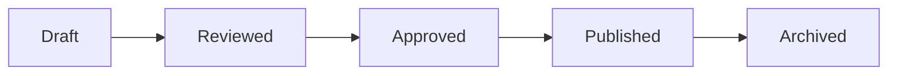

# ABAC System (Attribute-Based Access Control)

## Purpose
Define the permission model and enforcement patterns for AWCMS.

## Audience
- Admin panel developers
- Edge function authors

## Prerequisites
- `docs/security/overview.md`
- `docs/tenancy/overview.md`

## Core Concepts

AWCMS implements a comprehensive ABAC system that combines roles with policy enforcement.

---

## ABAC Architecture

```text
┌──────────────────────────────────────────────────────────────┐
│                      ABAC HIERARCHY                          │
├──────────────────────────────────────────────────────────────┤
│                                                              │
│   ┌─────────┐         ┌─────────┐         ┌─────────────┐   │
│   │  USERS  │────────▶│  ROLES  │────────▶│ PERMISSIONS │   │
│   └─────────┘         └─────────┘         └─────────────┘   │
│        │                   │                     │           │
│        │                   │                     ▼           │
│        │                   │              ┌─────────────┐   │
│        │                   └─────────────▶│   MODULES   │   │
│        │                                  └─────────────┘   │
│        │                                        │           │
│        │                                        ▼           │
│        │                                  ┌─────────────┐   │
│        │                                  │  CONDITIONS │   │
│        │                                  └─────────────┘   │
│        │                                        │           │
│        │                                        ▼           │
│        └─────────────────────────────────▶│  UI ACCESS  │   │
│                                           └─────────────┘   │
│                                                              │
└──────────────────────────────────────────────────────────────┘
```

---

## Database Schema

### Users Table

```sql
CREATE TABLE users (
  id UUID PRIMARY KEY DEFAULT gen_random_uuid(),
  email TEXT UNIQUE NOT NULL,
  full_name TEXT,
  role_id UUID REFERENCES roles(id),
  avatar_url TEXT,
  created_at TIMESTAMPTZ DEFAULT NOW(),
  updated_at TIMESTAMPTZ DEFAULT NOW(),
  deleted_at TIMESTAMPTZ
);
```

### Roles Table

```sql
CREATE TABLE roles (
  id UUID PRIMARY KEY DEFAULT gen_random_uuid(),
  name TEXT UNIQUE NOT NULL,
  description TEXT,
  is_system BOOLEAN DEFAULT FALSE,
  created_at TIMESTAMPTZ DEFAULT NOW()
);
```

### Permissions Table

```sql
CREATE TABLE permissions (
  id UUID PRIMARY KEY DEFAULT gen_random_uuid(),
  name TEXT UNIQUE NOT NULL,
  description TEXT,
  module TEXT NOT NULL,
  action TEXT NOT NULL
);
```

### Role Permissions (Junction)

```sql
CREATE TABLE role_permissions (
  role_id UUID REFERENCES roles(id) ON DELETE CASCADE,
  permission_id UUID REFERENCES permissions(id) ON DELETE CASCADE,
  PRIMARY KEY (role_id, permission_id)
);
```

---

## Final Role Hierarchy (ERP Standard)

### 1. Global Scope

- **Owner**: The supreme authority. Has access to everything.
- **Super Admin**: Platform administrator. Manages tenants and global settings.

### 2. Tenant Scope

- **Admin**: Tenant administrator. Full access within their own tenant.
- **Editor**: Content manager. Can review and approve content.
- **Author**: Content creator. Can create drafts but needs approval to publish.
- **Member**: Registered regular user.
- **Subscriber**: Read-only access to premium content.

### 3. System Roles

- **Public**: Anonymous visitors.
- **No Access**: Banned or disabled users.

---

## 2. Permission Matrix per Role (INTI)

### Matriks Hak Akses - Tenant Content

📌 _Semua permission hanya berlaku dalam tenant masing-masing_

#### A. Post / Page / Content

| Role                     |  C  |  R  |  U   |  P  | SD  | RS  | DP  | Description                     |
| :----------------------- | :-: | :-: | :--: | :-: | :-: | :-: | :-: | :------------------------------ |
| **Owner (Global)**       | ✅  | ✅  |  ✅  | ✅  | ✅  | ✅  | ✅  | Supreme authority (Global)      |
| **Super Admin (Global)** | ✅  | ✅  |  ✅  | ✅  | ✅  | ✅  | ✅  | Platform management (Global)    |
| **Admin (Tenant)**       | ✅  | ✅  |  ✅  | ✅  | ✅  | ✅  | ❌  | Tenant management (Tenant)      |
| **Editor (Tenant)**      | ✅  | ✅  |  ✅  | ✅  | ✅  | ❌  | ❌  | Content review & approval       |
| **Author (Tenant)**      | ✅  | ✅  | ✅\* | ❌  | ❌  | ❌  | ❌  | Content creation & update own   |
| **Member**               | ❌  | ✅  |  ❌  | ❌  | ❌  | ❌  | ❌  | Commenting & Profile management |
| **Subscriber**           | ❌  | ✅  |  ❌  | ❌  | ❌  | ❌  | ❌  | Premium content access          |
| **Public**               | ❌  | ✅  |  ❌  | ❌  | ❌  | ❌  | ❌  | Read-only access                |
| **No Access**            | ❌  | ❌  |  ❌  | ❌  | ❌  | ❌  | ❌  | Banned/Disabled                 |

_\* Author → hanya konten milik sendiri (tenant_id + owner_id)_

**Legend:**

- **C**: Create
- **R**: Read
- **U**: Update
- **P**: Publish
- **SD**: Soft Delete
- **RS**: Restore
- **DP**: Delete Permanent

---

## 1. Daftar Permission (Final & Konsisten)

### A. Platform (Global Scope)

| Permission Key     |  C  |  R  |  U  | SD  | RS  | DP  | Channel |
| :----------------- | :-: | :-: | :-: | :-: | :-: | :-: | :------ |
| `platform.tenant`  | ✅  | ✅  | ✅  | ✅  | ✅  | ✅  | web     |
| `platform.setting` | ❌  | ✅  | ✅  | ❌  | ❌  | ❌  | web     |
| `platform.module`  | ✅  | ✅  | ✅  | ❌  | ❌  | ❌  | web     |
| `platform.billing` | ❌  | ✅  | ✅  | ❌  | ❌  | ❌  | web     |
| `platform.user`    | ✅  | ✅  | ✅  | ✅  | ✅  | ✅  | web     |

### B. Tenant (Tenant Scope) - Standardized Pattern

**Format Permission**: `tenant.{module}.{action}`

**Actions Available**:

- `read` - View/list items
- `create` - Create new items
- `update` - Edit existing items
- `delete` - Soft delete items
- `restore` - Restore from trash
- `permanent_delete` - Permanently delete items
- `publish` - Publish content (content modules only)

> Note: The current codebase uses `permanent_delete` as the action key. The canonical action name in `AGENTS.md` is `delete_permanent`. Treat `permanent_delete` as a legacy alias until keys are normalized.

#### Content Modules

| Module        | Permission Prefix        | Actions                                                          |
| :------------ | :----------------------- | :--------------------------------------------------------------- |
| Articles      | `tenant.article.*`       | read, create, update, delete, restore, permanent_delete, publish |
| Pages         | `tenant.page.*`          | read, create, update, delete, restore, permanent_delete, publish |
| Portfolio     | `tenant.portfolio.*`     | read, create, update, delete, restore, permanent_delete          |
| Testimonies   | `tenant.testimonies.*`   | read, create, update, delete, restore, permanent_delete          |
| Announcements | `tenant.announcements.*` | read, create, update, delete, restore, permanent_delete          |
| Promotions    | `tenant.promotions.*`    | read, create, update, delete, restore, permanent_delete          |

#### Media Modules

| Module        | Permission Prefix        | Actions                                                 |
| :------------ | :----------------------- | :------------------------------------------------------ |
| Media         | `tenant.media.*`         | read, create, update, delete, manage                    |
| Photo Gallery | `tenant.photo_gallery.*` | read, create, update, delete, restore, permanent_delete |
| Video Gallery | `tenant.video_gallery.*` | read, create, update, delete, restore, permanent_delete |

#### Commerce Modules

| Module        | Permission Prefix        | Actions                                                 |
| :------------ | :----------------------- | :------------------------------------------------------ |
| Products      | `tenant.products.*`      | read, create, update, delete, restore, permanent_delete |
| Product Types | `tenant.product_types.*` | read, create, update, delete, restore, permanent_delete |
| Orders        | `tenant.orders.*`        | read, create, update, delete, restore, permanent_delete |

#### Navigation & Taxonomy

| Module     | Permission Prefix     | Actions                                                 |
| :--------- | :-------------------- | :------------------------------------------------------ |
| Menus      | `tenant.menu.*`       | read, create, update, delete                            |
| Categories | `tenant.categories.*` | read, create, update, delete, restore, permanent_delete |
| Tags       | `tenant.tag.*`        | read, create, update, delete, restore, permanent_delete |

#### User Management

| Module | Permission Prefix | Actions                      |
| :----- | :---------------- | :--------------------------- |
| Users  | `tenant.user.*`   | read, create, update, delete |

#### System

| Module           | Permission Prefix           | Actions                                                 |
| :--------------- | :-------------------------- | :------------------------------------------------------ |
| Settings         | `tenant.setting.*`          | read, update                                            |
| Themes           | `tenant.theme.*`            | read, create, update, delete                            |
| Audit Logs       | `tenant.audit.*`            | read                                                    |
| Notifications    | `tenant.notification.*`     | read                                                    |
| Contacts         | `tenant.contacts.*`         | read, create, update, delete, restore, permanent_delete |
| Contact Messages | `tenant.contact_messages.*` | read, create, update, delete, restore, permanent_delete |
| Regions          | `tenant.region.*`           | read, create, update, delete                            |
| Visual Pages     | `tenant.page.*`             | read, create, update, delete, restore                   |

#### Mobile & IoT

| Module        | Permission Prefix             | Actions                      |
| :------------ | :---------------------------- | :--------------------------- |
| Mobile Users  | `tenant.mobile_users.*`       | read, create, update, delete |
| Push Notif    | `tenant.push_notifications.*` | read, create, delete         |
| Mobile Config | `tenant.mobile_config.*`      | read, update                 |
| IoT Devices   | `tenant.iot_devices.*`        | read, create, update, delete |

### C. Public / Consumption

| Permission Key    |  R  | Channel     |
| :---------------- | :-: | :---------- |
| `content.read`    | ✅  | all         |
| `content.comment` | ✅  | web, mobile |
| `content.like`    | ✅  | web, mobile |

---

## Implementation

### Permission Context

```jsx
// src/contexts/PermissionContext.jsx
import React, { createContext, useContext, useState, useEffect, useCallback, useMemo } from 'react';
import { useAuth } from '@/contexts/SupabaseAuthContext';
import { udm } from '@/lib/data/UnifiedDataManager';

const PermissionContext = createContext(undefined);

export function PermissionProvider({ children }) {
  const { user } = useAuth();
  const [permissions, setPermissions] = useState([]);
  const [userRole, setUserRole] = useState(null);
  const [tenantId, setTenantId] = useState(null);
  const [abacPolicies, setAbacPolicies] = useState([]);
  const [loading, setLoading] = useState(true);

  // Fetches user permissions with offline fallback support
  const fetchUserPermissions = useCallback(async () => {
    // ... fetches from users table with deep joins
    // Falls back to waterfall queries if offline
  }, [user]);

  const hasPermission = useCallback(
    permission => {
      if (!permission) return true;
      if (['super_admin', 'owner'].includes(userRole)) return true;
      return permissions.includes(permission);
    },
    [permissions, userRole]
  );

  const hasAnyPermission = useCallback(
    permissionList => {
      if (['super_admin', 'owner'].includes(userRole)) return true;
      if (!permissionList || permissionList.length === 0) return true;
      return permissionList.some(p => permissions.includes(p));
    },
    [permissions, userRole]
  );

  // Check access with ownership awareness
  const checkAccess = useCallback(
    (action, resource, record = null) => {
      if (['super_admin', 'owner'].includes(userRole)) return true;
      const permissionKey = `tenant.${resource}.${action}`;
      if (permissions.includes(permissionKey)) return true;
      // Ownership check
      if (record?.created_by === user?.id) return true;
      return false;
    },
    [permissions, userRole, user]
  );

  // ABAC Policy evaluation
  const checkPolicy = useCallback(
    (action, resource, context = {}) => {
      if (['super_admin', 'owner'].includes(userRole)) return true;
      const finalContext = { channel: 'web', ...context };
      // Check deny policies
      const denyMatch = abacPolicies.some(policy => {
        if (policy.effect !== 'deny') return false;
        if (!policy.actions.includes('*') && !policy.actions.includes(action)) return false;
        if (policy.conditions?.channel && policy.conditions.channel !== finalContext.channel)
          return false;
        return true;
      });
      return !denyMatch;
    },
    [abacPolicies, userRole]
  );

  // Computed property for platform admin check
  const isPlatformAdmin = useMemo(() => {
    return ['owner', 'super_admin'].includes(userRole);
  }, [userRole]);

  const value = useMemo(
    () => ({
      permissions,
      userRole,
      tenantId,
      isPlatformAdmin,
      loading,
      hasPermission,
      hasAnyPermission,
      checkAccess,
      checkPolicy,
      refreshPermissions: fetchUserPermissions,
    }),
    [
      /* deps */
    ]
  );

  return <PermissionContext.Provider value={value}>{children}</PermissionContext.Provider>;
}

// Note: Hook is named usePermissions (plural)
export const usePermissions = () => {
  const context = useContext(PermissionContext);
  if (context === undefined) {
    throw new Error('usePermissions must be used within a PermissionProvider');
  }
  return context;
};
```

### Context API

| Property/Method                           | Type       | Description                                 |
| ----------------------------------------- | ---------- | ------------------------------------------- |
| `permissions`                             | `string[]` | Array of permission keys user has           |
| `userRole`                                | `string`   | Current user's role name                    |
| `tenantId`                                | `string`   | Current tenant UUID                         |
| `isPlatformAdmin`                         | `boolean`  | True if owner or super_admin                |
| `loading`                                 | `boolean`  | True while loading permissions              |
| `hasPermission(key)`                      | `function` | Check single permission                     |
| `hasAnyPermission(keys[])`                | `function` | Check if user has any of listed permissions |
| `checkAccess(action, resource, record?)`  | `function` | Check access with ownership awareness       |
| `checkPolicy(action, resource, context?)` | `function` | Evaluate ABAC policies                      |
| `refreshPermissions()`                    | `function` | Force reload permissions                    |

### Protected Component

```jsx
import { usePermissions } from '@/contexts/PermissionContext';

function ArticleActions({ article }) {
  const { hasPermission, checkAccess, isPlatformAdmin } = usePermissions();

  return (
    <div className="flex gap-2">
      {/* Simple permission check */}
      {hasPermission('tenant.article.update') && (
        <Button onClick={() => editArticle(article.id)}>Edit</Button>
      )}

      {/* Access check with ownership */}
      {checkAccess('delete', 'article', article) && (
        <Button variant="destructive" onClick={() => deleteArticle(article.id)}>
          Delete
        </Button>
      )}

      {/* Platform admin check */}
      {isPlatformAdmin && <Badge>Viewing as Admin</Badge>}
    </div>
  );
}
```

### Protected Route

```jsx
import { Navigate } from 'react-router-dom';
import { usePermissions } from '@/contexts/PermissionContext';

function ProtectedRoute({ children, permission }) {
  const { hasPermission, loading } = usePermissions();

  if (loading) return <LoadingSpinner />;

  if (!hasPermission(permission)) {
    return <Navigate to="/403" />;
  }

  return children;
}

// Usage
<Route
  path="/cmspanel/users"
  element={
    <ProtectedRoute permission="tenant.user.read">
      <UsersPage />
    </ProtectedRoute>
  }
/>;
```

---

## Menu Permissions

Sidebar menus are filtered based on user permissions:

```sql
CREATE TABLE menu_permissions (
  menu_id UUID REFERENCES menus(id),
  role_id UUID REFERENCES roles(id),
  can_view BOOLEAN DEFAULT FALSE,
  PRIMARY KEY (menu_id, role_id)
);
```

### Menu Visibility Logic

```javascript
const visibleMenus = allMenus.filter(menu => {
  // Super admin sees everything
  if (role === 'super_admin') return true;

  // Check menu permission for user's role
  return menuPermissions.some(
    mp => mp.menu_id === menu.id && mp.role_id === userRoleId && mp.can_view
  );
});
```

---

## API Security

Row Level Security (RLS) enforces permissions at database level:

```sql
-- Only users with 'view_articles' permission can select
CREATE POLICY "articles_select_policy" ON articles
FOR SELECT
USING (
  auth.jwt() ->> 'role' = 'super_admin'
  OR EXISTS (
    SELECT 1 FROM role_permissions rp
    JOIN permissions p ON rp.permission_id = p.id
    WHERE rp.role_id = (auth.jwt() ->> 'role_id')::uuid
    AND p.name = 'view_articles'
  )
);
```

---

## 🛡️ ABAC & Policy Engine (ERP Standard)

Starting from v2.5, AWCMS introduces Attribute-Based Access Control (ABAC) to support fine-grained, context-aware restrictions.

### Policy Structure

Policies are defined as JSON objects linked to Roles via the `role_policies` table.

```json
{
  "name": "Restrict Mobile Deletion",
  "effect": "deny",
  "actions": ["delete"],
  "conditions": {
    "channel": "mobile",
    "time_start": "09:00",
    "time_end": "17:00"
  }
}
```

### Evaluation Logic (`PermissionContext.jsx`)

1. **Super Admin Bypass**: Always TRUE.
2. **Global Policies**: Checked first.
3. **Role Policies**: Checked next.
4. **Logic**:
   - Default is **ALLOW** (ABAC foundation).
   - Policies act as **DENY** overrides (Restrictive model).
   - If _any_ policy matches the action/resource AND conditions evaluate to true, access is **DENIED**.

### Context Variables

| Variable     | Description                             | Source                     |
| ------------ | --------------------------------------- | -------------------------- |
| `channel`    | Interface used (`web`, `mobile`, `api`) | `useContext` or API Header |
| `ip_address` | Client IP                               | Edge Function              |
| `time`       | Server time                             | Edge Function              |

---

## 📋 Audit Trail System

Compliance-grade logging is enforced for all critical write operations.

### Schema (`audit_logs`)

| Field       | Type  | Description                                  |
| ----------- | ----- | -------------------------------------------- |
| `action`    | TEXT  | format: `resource.verb` (e.g. `user.create`) |
| `old_value` | JSONB | Snapshot before change                       |
| `new_value` | JSONB | Snapshot after change                        |
| `channel`   | TEXT  | Source (`web`, `mobile`, `api`)              |
| `tenant_id` | UUID  | Tenant isolation                             |

---

## 🔒 Multi-Device Access Control

### Channel Enum

- `web`: Main Dashboard & Portal
- `mobile`: IOS / Android Apps
- `api`: 3rd Party Integrations
- `all`: Universal access

### Security Principles

1. **Governance & Publish** → **Web Only**. Critical actions like changing settings or publishing content restricted to Web Dashboard.
2. **Mobile** → **Create & Update**. Field operations (writing drafts, uploading photos) allowed.
3. **API** → **Read-Heavy, Controlled Write**. Mostly for consumption. Writes require explicit API keys with scopes.

---

## ⚖️ Separation of Duties (SoD)

Ensures that critical processes involve multiple roles to prevent fraud or error.

| Activity              | Authorized Role |
| --------------------- | --------------- |
| **Create**            | Author          |
| **Review**            | Editor          |
| **Approve / Publish** | Admin           |
| **Governance**        | Owner           |

---

## 🔄 Workflow State Machine

Content modules (`posts`, `pages`) follow a strict lifecycle state machine:



| State       | Who can set?     |
| ----------- | ---------------- |
| `draft`     | Author, Editor   |
| `reviewed`  | Editor           |
| `approved`  | Editor, Admin    |
| `published` | Admin, Publisher |

---

## Best Practices

1. **Principle of Least Privilege**: Grant minimum permissions needed
2. **Role Separation**: Create specific roles for specific functions
3. **Audit Trail**: Log permission changes
4. **Regular Review**: Periodically review role assignments

## 🔒 Data Isolation & Security

To ensure strict multi-tenancy (SaaS), the following rules are enforced at the database level:

### 1. Mandatory `tenant_id`

All tables (except global system tables like `tenants`) MUST have a `tenant_id` column.

- **Type**: `UUID`
- **Reference**: `public.tenants(id)`
- **Constraint**: `NOT NULL` (enforced via migration)

### 2. RLS Enforcement (Strict)

Row Level Security (RLS) is enabled on **ALL tables** and has been audited for "Permissive" leaks.

- **Default**: Deny All.
- **Policy**: Must use `current_tenant_id()` helper.
- **Public Data**: Only specific global settings (`is_public=true`) or public content are exempted from strict tenant checks.

```sql
-- Standard Policy Pattern
CREATE POLICY "Tenant Isolation Select" ON table_name
FOR SELECT TO authenticated
USING (
  (tenant_id = public.current_tenant_id())
  OR
  (is_platform_admin()) -- Super Admins can see all
);
```

### 3. Performance & Indexing

- **Index required**: `CREATE INDEX ON table_name(tenant_id)`
- **Composite Indexes**: When frequently filtering by other columns, put `tenant_id` first (e.g., `(tenant_id, created_at)`).

### 4. Tier-Based Access

Feature access is dynamically filtered based on `tenants.subscription_tier` ('free', 'pro', 'enterprise').

- **UI**: Sidebar hides menu items (`checkTierAccess`).
- **API**: Extensions and advanced modules check tier capability before execution.

---

## 🔒 Extension Security Model

Extensions must strictly adhere to the AWCMS ABAC and Isolation standards.

### 1. Permission Registration

Extensions must use the standardized permission key format: `tenant.{extension_slug}.{action}`.

| Extension Type   | Format Example           | Scope  | Used By                  |
| ---------------- | ------------------------ | ------ | ------------------------ |
| **Core Plugin**  | `tenant.mailketing.send` | Tenant | `src/plugins/mailketing` |
| **External Ext** | `tenant.analytics.view`  | Tenant | `awcms-ext-analytics`    |

### 2. Implementation Pattern

Extensions should not invent their own security logic. Use the core `usePermissions` hook:

```javascript
import { usePermissions } from '@/contexts/PermissionContext';

const MyExtensionWidget = () => {
  const { hasPermission } = usePermissions();

  // Check custom extension permission
  if (!hasPermission('tenant.my_ext.view')) {
    return null; // Or <AccessDenied />
  }

  return <div>Extension Content</div>;
};
```

### 3. Database Isolation Compliance

Any tables created by extensions must:

1. Include `tenant_id` (UUID) foreign key.
2. Enable RLS (Row Level Security).
3. Implement standard "Tenant Isolation" policies.

---

## Permissions and Access

- Permission keys must follow `scope.resource.action`.
- Enforce checks at UI entry points, data operations, and edge functions.

## Security and Compliance Notes

- Tenant scope is mandatory for all permission checks.
- Soft delete applies to permission tables (filter `deleted_at`).

## Operational Concerns

- Permission seeding lives in scripts and migrations.
- Keep menu configuration aligned with permission keys.

## References

- `../03-features/ROLE_HIERARCHY.md`
- `../00-core/SECURITY.md`
